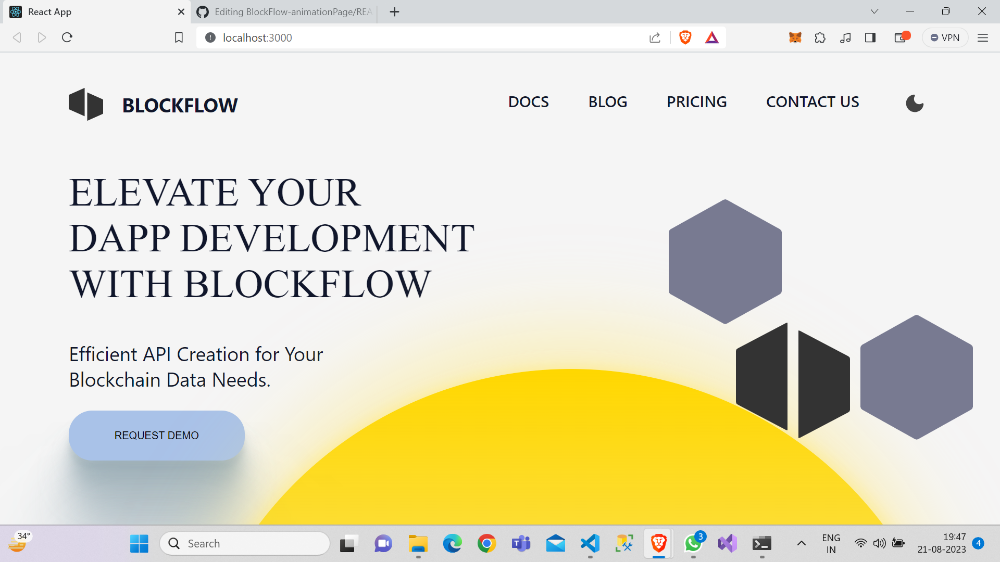
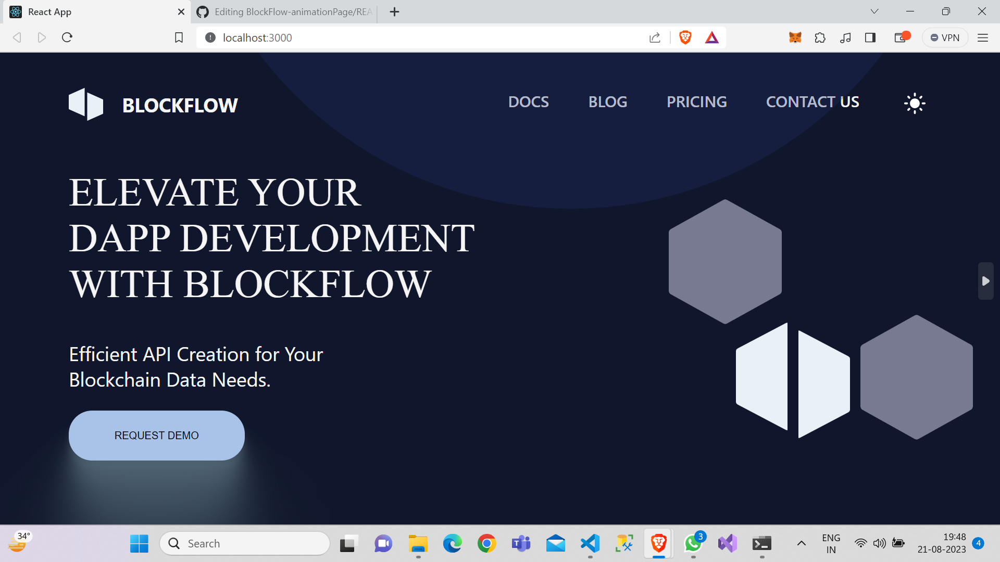

<!-- TABLE OF CONTENTS -->

  
Table of Contents

  <ol>
    <li>
      <a href="#about-the-project">About The Project</a>
      <ul>
        <li><a href="#built-with">Built With</a></li>
      </ul>
    </li>
    <li>
      <a href="#getting-started">Getting Started</a>
      <ul>
        <li><a href="#prerequisites">Prerequisites</a></li>
        <li><a href="#installation">Installation</a></li>
      </ul>
    </li>
    <li><a href="#usage">Usage</a></li> 
    <li><a href="#contact">Contact</a></li>
  </ol>

<!-- ABOUT THE PROJECT -->

## About The Project

This is the animation page assignment project for the task- BlockFlow SDE:Internship.
The project has a very cool animation effect when toggled between dark mode and light mode.

### Built With

 
🚀HTML
 
 
🚀CSS (Core)
 
🚀Javascipt
 
🚀React.JS
 

<!-- GETTING STARTED -->

## Getting Started

 
🌟Clone the Project on your local desktop by clicking on code green colored button and copy the HTTPS link code.
 
 
🌟Go to the project directory and open terminal/git bash
 
 
🌟Now, run the command 'git clone (paste the link that was copied)' and press enter , this should bring project on your local device
 

### Run The Project

 
🌟Open the project in the VS Code and go to terminal.
 
🌟On terminal install all the necessary packages by running 'npm install' command on terminal
 
🌟Now to launch the project run 'npm run start' , the project should start running on localhost:3000.
 

<!-- USAGE EXAMPLES -->

## Usage

